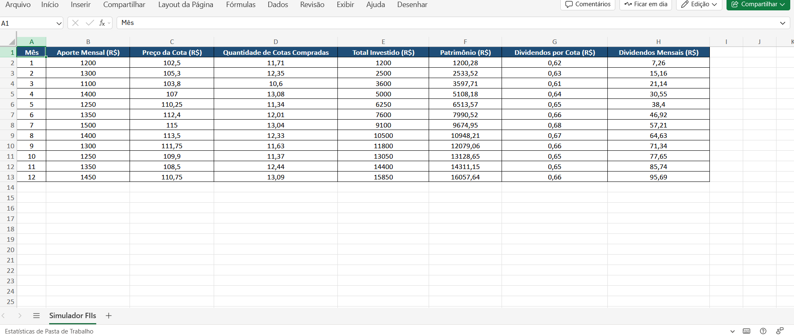

# Simulador de Investimentos em FIIs

Planilha em Excel para simular investimentos mensais em fundos imobiliários, com cálculo de patrimônio e dividendos.

## 📸 Exemplo da Planilha

---

## Como usar

1. Baixe a planilha `Simulador Investimentos.xlsx`.  
2. Insira seus próprios valores de aporte, preço da cota e dividendos.  
3. Veja o cálculo automático do patrimônio e dos dividendos mensais.  
4. Acompanhe a evolução dos seus investimentos facilmente.

---

## Sobre o projeto

Esse projeto foi desenvolvido para o desafio da DIO, visando aplicar conceitos de Excel para simulação de investimentos em FIIs.

---

### Autor

Rodrigo Rangel
